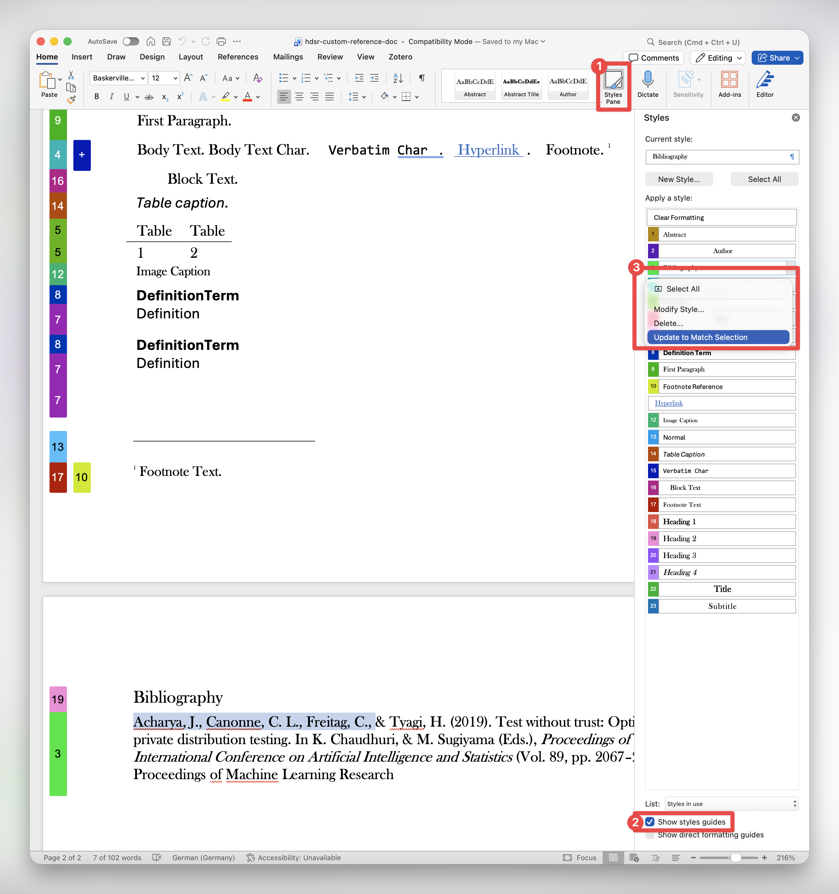

## Customisation promises and perils

Custom templates and multi-format publishing in Quarto promises the elegance of building documents like Lego, but often feels more like hacking partially assembled IKEA furniture. In theory, connecting existing format-specific templates to Quarto is pretty straightforward -- just take the Latex, Typst or other template, and replace the **right** bits with Pandoc conditionals and variables. A few small issues with this:

1. Knowing which bits to replace and which to keep as is, generally requires knowing something about how the original format compiles and renders;
2. Pandoc and Quarto parsing cleverness can result in unexpected behaviour that is not "wrong" per se, but definitely not what you wanted. Debugging requires isolating exactly where unwanted commands are being brought in, which again requires non-trivial understanding of how Pandoc and Quarto work.
3. Even if you figure out how to set things up so your Quarto renders to the custom template. What happens when the upstream template changes? Does this totally break your workflow? What's the best way to incorporate upstream changes?

Given all of these problems, why bother with templates? Why not just use Overleaf and write directly in LaTeX? Well, sometimes I do (usually when collaborating). However, being able to write in Quarto markdown only and not switching between LaTeX, Typst, MS Word, and HTML is oh-so-satisfying. My work often spans multiple possible publication venues with different templates and submission requirements. This variety makes specializing in a single journal template and workflow inefficient and overly rigid -- which also makes resubmitting a rejected paper to a new venue that much more painful. But probably most importantly, I enjoy the tinkering and *really enjoy* the satisfaction of hacking my way out of having to copy, paste or edit text just for formatting purposes.

In this post, I share two recent custom format + Quarto hack jobs, and some general tips for incorporating format-specific templates into Quarto.

<!-- being able to do things like multi-format CVs, and having a go-to template for RevealJS slides.  -->

## MS Word Templates for an existing Quarto document

I recently prepared a submission for a journal which provides an official MS Word template. There is also a LaTeX template, but you're only allowed to use that if your paper contains mathematical equations.^[Having already written my paper in Quarto markdown outputting PDF via LaTeX, and having some experience with LaTeX templates in Quarto, but none with DOCX templates, I considered for a brief moment whether I could include some mathematical equations to avoid having to download MS Word.] Luckily, Quarto (via Pandoc) outputs to DOCX, which also supports custom styles via a custom reference document.^[[Word Templates, Quarto Official Documentation](https://quarto.org/docs/output-formats/ms-word-templates.html)]

I ended up with a workflow that rendered most of the contents of my original QMD file (`index.qmd`) into DOCX, using styles defined via a custom reference document (`custom-reference-doc.docx`), which I eventually combined with a few manually entered elements (`manual-elements.docx`) into my final submission (`merged-submission.docx`). My folder directory looked something like:

```
.
├── ...
├── _utilities
│  ├── Journal-Provided-Template.docx
│  └── custom-reference-doc.docx
├── index.qmd
├── references.bib
└── submissions
    ├── index.docx                                        # generated from `index.qmd`
    ├── manual-elements.docx                # elements I couldn't get Quarto to generate
    └── merged-submission.docx           # final combination of generated & manual content

```

### Creating a custom reference DOCX

My development loop for `custom-reference-doc.docx` went something like this:

1. Initialise custom reference doc via:
```zsh
quarto pandoc -o custom-reference-doc.docx \ --print-default-data-file reference.docx`
```

2. Copy and paste relevant formats from the official template `Journal-Provided-Template.docx` as custom styles in `custom-reference-doc.docx` (ignoring any that I didn't need (e.g. Level 5 Headings)).

3. Render `index.qmd` with the following YAML:
```yaml
format:
  docx:
    reference-doc: '_utilities/custom-reference-doc.docx'
```

4. Compare the output file `index.docx` with the template `Journal-Provided-Template.docx`, and tweak `custom-reference-doc.docx`.

5. Anything couldn't easily work out how to get Quarto to generate I left as manual entry or copy/paste jobs that I version controlled in `manual-elements.docx` (e.g. journal logo, authors, affiliations and CRediT statement). It is definitely wise to watch your cost/benefit ratio here -- just because many things are theoretically possible via Quarto + Pandoc, doesn't mean it's worth your time...

::: {.callout-tip collapse="true"}
## Editing Custom Styles in MS Word



See the 'Modifying the styles' section of this [taonaw.com blog post](https://taonaw.com/2026/02/01/org-files-to-beatiful-docx.html) for a video walkthrough.

:::

## Quarto Custom Format Extensions

The MS Word template above was saved in the same repository as the QMD file I was rendering. However, sometimes, you might want to reuse the same custom format template in multiple projects. This is where Quarto Custom Format extensions come in handy. Custom Format extensions bundle up all the inputs and settings needed to specific a custom format easily as a single argument to the `format:` variable in the YAML header of QMD files.^[I've written previously about what exactly constitutes a Custom Format extension in the Quarto extension world in this [blog post](https://www.cynthiahqy.com/posts/quarto-extensions-explainer/)].  Custom Format extensions publicly hosted on GitHub (e.g=. `github.com/cynthiahqy/quarto-typst-tvcg`[https://github.com/cynthiahqy/quarto-typst-tvcg]) can be easily added to any Quarto repository via `quarto add <extension>`.

Although there is documentation on what custom formats should contain and numerous examples on the [Custom Formats](https://quarto.org/docs/extensions/formats.html) and [Journal Formats](https://quarto.org/docs/journals/formats.html) pages of the official Quarto Docs, these examples are relatively simple and straightforward. In reality, I find adapting an existing template to work with Quarto requires quite a bit of trial and error, perseverance and ideally expert resources on Quarto, Pandoc and whatever format you're working with easily available. The latter I cannot help with, but I can share my general workflow strategy:

1. Set up a new repository for the Quarto template -- I usually call mine something like `quarto-<format>-<template>` (e.g. `quarto-typst-tvcg` for a template based on the official TVCG Typst template.)
2. If the format-specific template is available as a git repo, add it as submodule. This helps with versioning. Otherwise, include the template and template resources directly.
3. Find any template files in the format-specific submodule (e.g. `ieee-vgtc-typst/template/conference.typ`). These files usually includes some sample text and content. Figure out what other files and/or packages are needed to render those example templates (e.g. `lib.typ` defines all the styles and formatting that make up the VGTC template). You'll need to include these in your extension.
3. Set up the Quarto `_extensions/` folder with the relevant skeleton files^[use guides in the Quarto docs or the source code of existing custom format[extensions](https://quarto.org/docs/extensions/listing-formats.html) as reference].
5. Set up a QMD template that renders to your new custom format.

### Example Quarto-Typst Extension

The initial setup should result in a directory that looks something like:

```md
./
├── _extensions/
│   └── ieee-vgtc/
│       ├── _extension.yml
│       ├── **typst-conf-show.typ**
│       └── typst-journal-show.typ
├── **template-conf.qmd**
├── template-journal.qmd
├── ieee-vgtc-typst/ <!-- SUBMODULE -->
│   ├── CONTRIBUTING.md
│   ├── LICENSE
│   ├── README.md
│   ├── assets/
│   │   ├── diamondrule.svg
│   │   └── orcid.svg
│   ├── lib.typ
│   ├── link.ps1
│   ├── link.sh*
│   ├── preview.pdf
│   ├── template/
│   │   ├── **conference.typ**
│   │   ├── conference_latex_ref.pdf
│   │   ├── figs/
│   │   ├── journal.typ
│   │   ├── journal_latex_ref.pdf
│   │   └── refs.bib
│   ├── thumbnail.png
└─└── typst.toml
```

::: {.callout-tip collapse="true"}
## Typst package manifests
An aside on Typst packages^[https://github.com/typst/packages/blob/main/README.md] -- all Typst packages have a manifest in the file `typst.toml` that looks something like (truncated for clarity):

```toml
[package]
name = "ieee-vgtc"
version = "0.0.3"
...
entrypoint = "lib.typ"
repository = "https://github.com/ieeevgtc/ieee-vgtc-typst"
...

[template]
path = "template"
entrypoint = "journal.typ"
thumbnail = "thumbnail.png"
```

The important fields for writing a custom Quarto format are the package and template `entrypoint` -- the first is the main Typst file that is evaluated when the package is imported via `#import` statements; and the second is generally what you'll adapt into a Quarto / Pandoc template.
:::

<!-- TODO: aside about the relationship between quarto & pandoc - link to a good explainer -->

Next, let's create the Quarto Custom Format -- prepare for lots of iterations:

1. Copy the format specific template into your skeleton extensions template file (e.g. `ieee-vgtc-typst/template/conference.typ` into `_extensions/typst-conf-show.typ`).
2. Figure out where YAML variables should go in your skeleton. Insert placeholders for these inputs with [Pandoc template variables](https://www.pandoc.org/demo/example33/6.1-template-syntax.html).
1. Figure out what is sample body text -- replace this with special the `$body$` variable. This is where the main body contents of your QMD will go (i.e. anything below the YAML header).
2. Set the YAML contributions in `_extension.yml` to use this new template when rendering QMD files to this new format.
3. Populate your template QMD with the relevant variables and content, and set it to use your new extension format.
4. Render your template QMD file and debug -- repeating until it works.

The three main files that you'll need to write to get a custom format working are the YAML settings contributed by the format (`_extension.yml`), the Pandoc template for the format you're rendering to (e.g. `typ-conf-show.typ`), and an example QMD file that uses your custom format (optional, but a very useful future reference on how to use this format when you've forgotten everything you knew while hacking it together).

The following tabset shows these three files for a custom Quarto format based on the official IEEE TVCG Typst template.

::: {.panel-tabset}
### Extension YAML

The `_extension.yml` file specifies YAML options that get merged into your main `index.qmd` when you specify `format: <extension-format>`:

```{.yaml filename='_extensions/_extension.yml'}
title: IEEE TVCG Typst Template
author: Cynthia Huang
version: "0.0.2"
quarto-required: ">=1.4.11"
contributes:
  formats:
    typst+conf:
      template: typst-conf-show.typ
    typst+journal:
      template: typst-journal-show.typ
```

### Pandoc Template

I generated this by passing Claude `ieee-vgtc-typst/template/conference.typ` and tweaking against Quarto Typst templates, the [Quarto Front Matter YAML spec](https://quarto.org/docs/authoring/front-matter.html#authors-and-affiliations) and my own experiments. A few tips:

- Make sure to replace any sample Typst content (e.g. that was in `conference.typ`) with `$body$` to grab the content from your Quarto markdown file.
- You can map Quarto metadata fields to Typst fields even if the names don't exactly match (e.g. I mapped Quarto `affiliation` details to the `organization:` field in the official Typst template). You could alternatively provide different author metadata just for these formats using [profiles](https://quarto.org/docs/projects/profiles.html) (but that's a different post)
<!-- - I would recommend debugging with the help of an LLM, but for completeness you might refer to the [Pandoc Template Syntax](https://www.pandoc.org/demo/example33/6.1-template-syntax.html) -->

```{.typst .code-overflow-wrap filename='_extensions/typst-conf-show.typ'}
#import "@preview/ieee-vgtc:0.0.2": conference

#show: conference.with(
  $if(review)$
  review: $review$,
  $endif$
  $if(submission-id)$
  submission-id: $submission-id$,
  $endif$
  $if(category)$
  category: "$category$",
  $endif$
  $if(paper-type)$
  paper-type: "$paper-type$",
  $endif$
  $if(title)$
  title: [$title$],
  $endif$
  $if(abstract)$
  abstract: [$abstract$],
  $endif$
  $if(by-author)$
  authors: (
$for(by-author)$
$if(it.name.literal)$
    ( name: "$it.name.literal$",
      organization: [$for(it.affiliations)$$it.name$$sep$, $endfor$],
      orcid: "$it.orchid$",
      email: "$it.email$" ),
$endif$
$endfor$
    ),
$endif$
  $if(teaser)$
  teaser: (
    $if(teaser.image)$
    image: image("$teaser.image$", alt: "$teaser.image-alt$"),
    $endif$
    $if(teaser.caption)$
    caption: "$teaser.caption$"
    $endif$
  ),
  $endif$
  $if(index-terms)$
  index-terms: ($for(index-terms)$"$it$"$sep$, $endfor$),
  $endif$
  $if(bibliography)$
  bibliography: bibliography("$bibliography$"$if(csl)$, style: "$csl$"$endif$),
  $endif$
)

$body$
```

### Example QMD

This is the file you actually write in. I try to include all variables that could be read into `_extensions/typst-conf-show.typ` in the YAML header for reference. I also used Claude to generate the YAML header (based on the Pandoc Template).

````{.md filename="template-conf.qmd"}
---
format: ieee-vgtc-typst+conf
review: false
submission-id: 1234
category: "Research"
paper-type: "algorithm/technique"
title: "Global Illumination for Fun and Profit"
abstract: "... "
authors:
  - name: "Josiah S. Carberry"
    organization: "Brown University"
    orcid: "0000-0002-1825-0097"
    email: "jcarberry@example.com"
  - name: "Ed Grimley"
    organization: "Grimley Widgets, Inc."
    email: "ed.grimley@example.com"
  - name: "Martha Stewart"
    organization: "Martha Stewart Enterprises at Microsoft Research"
    email: "martha.stewart@example.com"
teaser:
  image: "figs/clouds.jpg"
  image-alt: "A view of clouds with orange sun rays shining through from behind."
  caption: "Dramatic evening clouds. Note that the teaser may not be wider than the abstract block."
index-terms:
  - "Radiosity"
  - "global illumination"
  - "constant time"
bibliography: "refs.bib"
---

# Introduction

I can write normal Quarto markdown here.

You can prevent Quarto (and Pandoc) from parsing content by using [Pandoc's raw attribute](https://pandoc.org/MANUAL.html#extension-raw_attribute).

```{=typst}
= Raw Content

This is useful for content that should be passed through directly into the Typst file (which can then be compiled into PDF).
```
````
:::

## General Tips & Tricks

- **Leverage LLMs**: Pass the original format template statement through and LLM and ask it to create a Pandoc Template. You'll need to make sure that the variables match Quarto YAML variables (authors is trickiest in my experience).
 **Understand Quarto partials**: Famililarise yourself with how [Quarto template partials work](https://quarto.org/docs/journals/templates.html#template-partials).^[There may also be additional docs on how the partials for a particular format work -- e.g. in the [Typst Custom Format guide](https://quarto.org/docs/output-formats/typst-custom.html#advanced-customization).] Looking at the source code of the templates will show you what Quarto is injecting alongside the format template you wrote when rendering your QMD file. If you use partials rather than replacing Quarto's base format templates completely, you can get conflicting or duplicate injections.^[For example, I spent some time debugging multiple bibliographies not supported error, that was due to both Quarto and the Typst IEEE TVCG package adding `bibliography()` calls. The relevant partial was [`biblio.typ`](https://github.com/quarto-dev/quarto-cli/blob/main/src/resources/formats/typst/pandoc/quarto/biblio.typ), which was called by the main Quarto Typst template [`template.typ`](https://github.com/quarto-dev/quarto-cli/blob/main/src/resources/formats/typst/pandoc/quarto/template.typ). To get around this, I completely replaced the main Quarto Typst template with one I created myself based on the template in the Typst package I was adapting.]
- **Use Intermediate Output for Debugging**: Set `keep-*:` to true in your example QMD, and the render that intermediate output to debug your template. The intermediate file will show you how Quarto is combining content from your QMD using the Pandoc template you provided and any applicable partials. For example, I copied the intermediate `.typ` into a Typst universe project to get better hints and error messages. You could do the same with `.tex` files and debug them on Overleaf. Make sure to transfer any fixes back into your local source files.
- **Compilation and rendering errors:** It turns out that the IEEE TVCG Typst package required a more recent version of Typst than what Quarto bundles. There's a thread about this type of lagging in the [quarto-dev discussions](https://github.com/orgs/quarto-dev/discussions/11142). Long story short, the Quarto dev team prioritises stability, but you can specify non-standard configurations via the `QUARTO_TYPST` global variable.